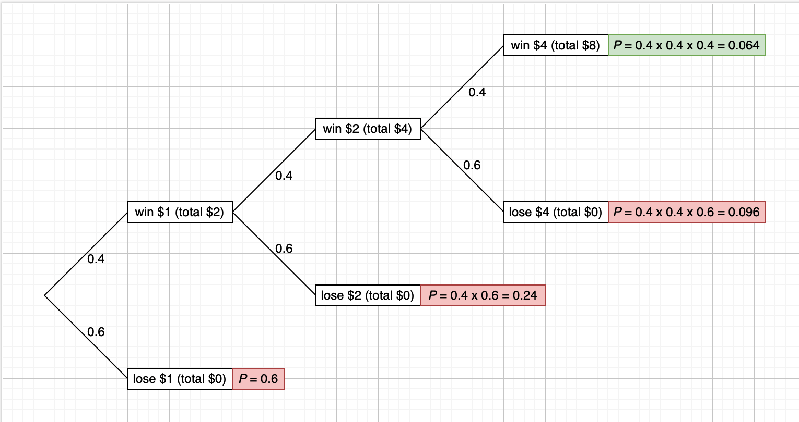

```{r, message=FALSE}
seed <- 1234
library(plyr)
library(tidyverse)
```

# Description 

Smith is in jail and has \$1; he can get out on bail if he has \$8.
A guard agrees to make a series of bets with him. If Smith bets A dollars,
he wins A dollars with probability .4 and loses A dollars with probability .6.
Find the probability that he wins \$8 before losing all of his money if

(a) he bets \$1 each time (timid strategy).
(b) he bets, each time, as much as possible but not more than necessary to
bring his fortune up to \$8 (bold strategy).
(c) Which strategy gives Smith the better chance of getting out of jail?

# Solution
## Timid Strategy 
### Simulation

The code below simulates if the first strategy is carried out in 10,000 simulations. Each simulation tracks the amount of money Smith has as he continues to bet, and ends when he has run out of money or has successfully won $8.

```{r}
set.seed(seed = seed)
outcomes <- c(-1, 1)
ps <- c(0.6, 0.4)
sims <- 10000
num_ws <- 0
num_ls <- 0
rws <- list()

for(i in 1:sims){
  total <- 1
  rw_y <- c(1)
  j <- 2
  while(total > 0 & total < 8){
    total <- total + sample(outcomes, size=1, prob=ps)
    rw_y[j] <- total
    j <- j + 1
  }
  if(total == 0){
    num_ls <- num_ls + 1
  }
  else{
    num_ws <- num_ws + 1
  }
  rw_y <- matrix(rw_y, nrow=1)
  rws[[i]] <- rw_y
}
```

Each simulation tracks the amount of money Smith has over the course of his bets, and we can see the result of all them in the plot below: 

```{r}
rws <- t(rbind.fill.matrix(rws))
matplot(x = 0:(dim(rws)[1]-1), y = rws, 
        type='l', 
        lty='solid',
        xlab='Num Games Played',
        ylab='Total Amount ($)')
```

Because many of the simulations provide overlapping lines, the plot below gives a clearer picture how many bets took place in each simulation: 

```{r}
hist(colSums(!is.na(rws)),
     breaks=50, main='Simulation Length', xlab='# of Bets')
```

As expected, we see that almost all the simulations ended after the first few bets. The cell below finally calculates the percentage of simulations that resulted in Smith getting out of jail: 

```{r}
num_ws / sims
```

In other words, the simulations of the timid strategy result in Smith getting out of jail only ~2% of the time. 

### Theory

Previous analysis of the "Gambler's Ruin" phenomenon allows us to actually calculate the expected probability that Smith should win enough money to get out of jail. More specifically, the following formula can determine $q_z$, which is the probability that a gambler’s stake reaches 0, i.e., they are ruined, before it reaches $M$, given that the initial stake is $z$: 

$$
q_z = 1- \frac{(q/p)^z-1}{(q/p)^M-1}
$$

such that $p$ and $q$ are the probabilities of winning and losing each game, respectively ([from page 488 of Snell](https://math.dartmouth.edu/~prob/prob/prob.pdf)). In our case, $p=0.4$, $q=0.6$, $M=8$, and $z=1$. Plugging in, we have:

```{r}
p_ruin <- 1 - ((0.6/0.4)^1-1) / ((0.6/0.4)^8-1)
p_ruin
```

Thus, the probability that Smith will win is: 

```{r}
1-p_ruin
```

This is very close to the probability that we estimated via simulation. 

## Bold Strategy
### Theory

In this case, it makes sense to first compute what the probability of Smith winning should be. For the bold strategy we can actually quite easily represent all of the possible outcomes on a probability tree: 



According to the probability tree above, the only way to reach \$8 is two win the bet three times in a row, which has a $0.4^3 = 0.064$ probability of happening. 

## Simulation

We can now check whether our theoretical calculation aligns with empirical results. The code below simulates if the bold strategy is carried out in 10,000 simulations, and tracks the amount of money Smith has as he continues to bet. The simulation ends when he has run out of money or has successfully won $8.

```{r}
set.seed(seed = seed)
outcomes <- c(-1, 1)
ps <- c(0.6, 0.4)
sims <- 10000
num_ws <- 0
num_ls <- 0
rws <- list()

for(i in 1:sims){
  total <- 1
  rw_y <- c(1)
  j <- 2
  while(total > 0 & total < 8){
    to_win <- 8 - total
    if (to_win > total){
      total <- total + total * sample(outcomes, size=1, prob=ps) 
    }
    else{
      total <- total + to_win * sample(outcomes, size=1, prob=ps)
    }
    rw_y[j] <- total
    j <- j + 1
  }
  if(total <= 0){
    num_ls <- num_ls + 1
  }
  else{
    num_ws <- num_ws + 1
  }
  rw_y <- matrix(rw_y, nrow=1)
  rws[[i]] <- rw_y
}

rws <- t(rbind.fill.matrix(rws))
```

We can see the result of all the simulations in the plot below: 

```{r}
matplot(x = 0:(dim(rws)[1]-1), y = rws, 
        type='l', 
        lty='solid',
        xlab='Num Games Played',
        ylab='Total Amount ($)')
```

We see that the above plot exactly matches the structure of the previous probability tree, giving confidence to the fact that our simulations were carried out correctly. Finally, the cell below determines the percentage of times Smith was able to escape prison using this methodology:

```{r}
num_ws / sims
```

Once again, we end up with an estimated probability that is almost exactly our theoretical, expected value. 

## Conclusion

Based off the analysis above, which were confirmed via simulated results, we can safely say that Mr. Smith should implement the bold strategy when playing this game with the prison guard: his chance of winning with the bold strategy is 6.4%, compared with only ~2.03% with the timid strategy.  