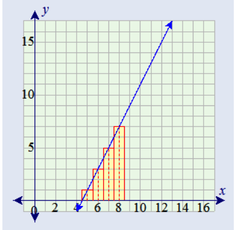

# Question 1 

## Description 

Use integration by substitution to solve the following integral: $\int 4e^{-7x} \ dx$.

## Solution

Let $u = -7x$. Then, $\frac{du}{dx} = -7 \rightarrow du = -7 \ dx$. Substituting into our integral:

$$
\begin{align}
\int 4e^{-7x} \ dx &= \int -\frac{4}{7}e^u \ du \\
&= -\frac{4}{7} \int e^u \ du \\
&= -\frac{4}{7}e^u+C 
\end{align}
$$

Substituting back in for $x$ gives the final solution: $\int 4e^{-7x} \ dx = -\frac{4}{7}e^{-7x}+C$.

# Question 2

## Description 

Biologists are treating a pond contaminated with bacteria. The level of contamination is changing at a rate of $\frac{dN}{dt} = -\frac{3,150}{t^4}-220$ bacteria per cubic centimeter per day, where $t$ is the number of days since treatment began. Find a function $N(t)$ to estimate the level of contamination if the level after 1 day was 6,530 bacteria per cubic centimeter. 

## Solution 

Via the fundamental theorem of calculus we know that: $\int \frac{dN}{dt} \ dt = N(t)$. This integration is performed below:

$$
\begin{align}
\int \frac{dN}{dt} &= \int -\frac{3,150}{t^4}-220 \ dt  \\
&= \frac{1,050}{t^3} -220t + C \\
\end{align}
$$

Thus, $N(t) = \frac{1050}{t^3} -220t + C$. To solve for $C$, we use the fact that $N(1) = 6,530$ and plug into our equation:


$$
\begin{align}
N(1) &= \frac{1,050}{(1)^3} -220(1) + C \\
6,530 &= 1,050 - 220 + C \\
C &= 5,700
\end{align}
$$

Thus, in conclusion we have that: $N(t) = \frac{1050}{t^3} -220t + 5,700$.

# Question 3

## Description 
Find the total area of the red rectangles in the figure below, where the equation of the line is $f(x) = 2x + 9$.

<center>

</center>

## Solution

We can see from the graph that starting from the leftmost rectangle, their heights are 1, 3, 5, and 7. Since the width of each rectangle is 1, these are also their areas. Thus, the area of the rectangles (and also the area under the $f(x)$ from 4.5 to 8.5) = 1 + 3 + 5 + 7 = 16. However, we can arrive at the same answer via integration. The area $A$ under a function $f(x)$ between a range $a$ to $b$ can be written as: $A = \int_a^b f(x) \ dx$. Thus, in this case:

$$
\begin{align}
A &= \int_{4.5}^{8.5} 2x-9 \ dx \\
&= x^2 - 9x \ |_{4.5}^{8.5} \\
&= x(x-9) \ |_{4.5}^{8.5} \\
&= 8.5(8.5-9) - 4.5(4.5-9) \\
&= 8.5(-0.5) - 4.5(-4.5) \\
&= -4.25 + 20.25 \\
&= 16
\end{align}
$$

Thus, we have confirmed that the same answer can be found via integration of $f(x)$.

# Question 4
## Description

Find the area of the region bounded by the graphs of the given equations. $y = x^2 - 2x + 2$ and $y = x + 2$. 

## Solution 

First, the code cell below makes a graph of the two equations.

```{r}
x <- seq(-2, 5, 0.1)
y1 <- x^2 - 2*x + 2
y2 <- x + 2

plot(x,y1,type="l",col="red", ylab='y')
lines(x,y2,col="green")
```

We see that the line $y=x-2$ cuts through the parabola $y=x^2-2x-2$ and creates a bounded area between the two graphs. In general, the area $A$ bounded by two functions $f(x)$ and $g(x)$ can be written as: $A = \int_a^b f(x)-g(x) \ dx$, where $a$ and $b$ are the beginning and endpoints of the bounded region and $f(x)$ is above $g(x)$. 

To find $a$ and $b$ in this case, we can set our two equations equal to each other and solve:

$$
\begin{align}
x^2 - 2x - 2 &= x + 2 \\
x^2 - 3x - 4 &= 0 \\
(x-4)(x+1) &=0 \\
x &= (-1, 4)
\end{align}
$$

We now setup and solve for $A$:

$$
\begin{align}
A &= \int_{-1}^{4} (x^2-2x-2) - (x+2) \ dx \\
&= -x^2 + 3x + 4 \ dx \\
&= -\frac{x^3}{3} + \frac{3x^2}{2} + 4x\  |_{-1}^4 \\
&= \left( -\frac{(4)^3}{3}+ \frac{3(4)^2}{2} + 4(4) \right) - \left( -\frac{(-1)^3}{3}+ \frac{3(-1)^2}{2} + 4(-1) \right) \\
&= \left( -\frac{64}{3}+ \frac{48}{2} + 16 \right) - \left(\frac{1}{3}+ \frac{3}{2} -4 \right) \\
&= -\frac{64}{3}+40+\frac{13}{6} \\
&= -\frac{128}{6}+\frac{240}{6}+\frac{13}{6} \\
&= \frac{125}{6} \\
\end{align}
$$

Thus, the area bounded by the two regions is \frac{125}{6}.

# Question 5
## Description

A beauty supply store expects to sell 110 flat irons during the next year. It costs \$3.75 to store one flat iron for one year. There is a fixed cost of \$8.25 for each order. Find the lot size and the number of orders per year that will minimize inventory costs.

## Solution

Let $x$ equal the number of orders, and $y$ be the number of irons included in each order. In addition, let's assume that on average half the number of irons are stored per order. In that's the case, then the total cost $C$ of storing and ordering the irons can be written as:  

$$
C = 3.75 \cdot \frac{y}{2} + 8.25x
$$

Since the total number of irons expected to be sold is 110, we also know that $xy$ = 100. Thus, $y = \frac{110}{x}$ and we can rewrite the above equation as: 

$$
C = \frac{206.25}{x} + 8.25x
$$

To maximize the number of orders, we need to find $\frac{dC}{dx}$, set it to 0, and solve for $x$. This is done below:

$$
\begin{align}
\frac{dC}{dx} &= -\frac{206.25}{x^2} + 8.25 \\
0 &= -\frac{206.25}{x^2} + 8.25 \\
8.25 x^2 &= 206.25 \\
x^2 &= 25 \\
x &= 5
\end{align}
$$

Thus, the optimal value for $x$ is 5, and the optimal value for $y$ is: $y = \frac{110}{5} = 22$.

# Question 6

## Description 

Use integration by parts to solve the following integral: $\int \ln(9x)\cdot x^6  \ dx$. 

## Solution

Integration by parts provides a methodology by which one can solve integrals that are products of separate functions, and is typically written out mathematically as follows: $\int udv = uv - \int v du$ where both $u$ and $v$ are functions of the same variable. To determine which one of our functions will be $u$, we can use the [ILATE rule](https://www.cuemath.com/calculus/ilate-rule/). In this case, our choices for $u$ and $dv$ are as follows:

$$
\begin{align}
u &= \ln(9x) \\
dv &= x^6 \ dx
\end{align}
$$

This means that: 

$$
\begin{align}
\frac{du}{dx} &= \frac{1}{x} \\
du &= \frac{1}{x}dx
\end{align}
$$

and: 

$$
\begin{align}
v &= \int dv \\
v &= \int x^6 \ dx \\
v &= \frac{x^7}{7}
\end{align}
$$

To summarize, we now have that $u = \ln(9x)$, $du = \frac{1}{x}\ dx$, $v = \frac{x^7}{7}$, $dv = x^6 \ dx$. Plugging these into the integration by parts equation gives:


$$
\begin{align}
\int \ln(9x)\cdot x^6  \ dx &= \ln(9x)\left(\frac{x^7}{7}\right) - \int \left(\frac{x^7}{7}\right)\left(\frac{1}{x}\right) \ dx \\
&= \frac{\ln(9x)x^7}{7} - \int \frac{x^6}{7} \ dx \\
&= \frac{\ln(9x)x^7}{7} - \frac{x^7}{49} + C\ \\
&= \frac{\ln(9x)x^7}{7} - \frac{x^7}{49} + C\ \\
&= \frac{x^7(7\ln(9x)-1)}{49} + C
\end{align}
$$

# Question 7

## Description 

Determine whether $f(x) = \frac{1}{6x}$ is a probability density function (PDF) on the interval $[1, e^6]$. If not, determine the value of the definite integral.


## Solution 

In order for $f(x)$ to be a PDF on the range $[1, e^6]$, it must be the case that $\int_1^{e^6} f(x) \ dx = 1$. This is because the sum of all the probabilities from the shown in the PDF must be equal to 1. To check this, the integral is completed below:


$$
\begin{align}
\int_1^{e^6} f(x) \ dx &= \int_1^{e^6} \frac{1}{6x} \ dx  \\ 
&= \frac{1}{6}\int_1^{e^6} \frac{1}{x} \ dx \\
&= \frac{1}{6} \ln|x| \ |_1^{e^6} \\
&= \frac{1}{6}(\ln(e^6) - \ln(1)) \\
&= \frac{1}{6}(6-0) \\
&= 1
\end{align}
$$

Thus, the $f(x)$ is a PDF on the range $[1, e^6]$. A plot of the function is shown below: 

```{r}
x <- seq(1, 404, 0.1)
y <- 1 / (6 * x)

plot(x,y,type="l",col="red", ylab='y')

```