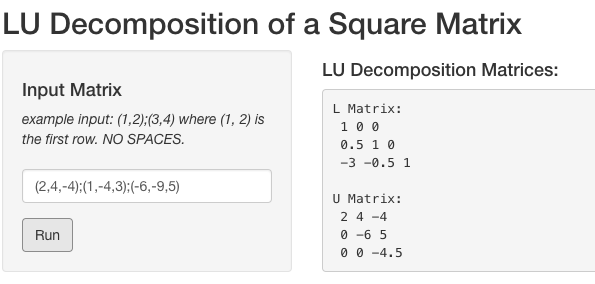

```{r setup, include=FALSE}
knitr::opts_chunk$set(echo = TRUE)
library(tidyverse)
library(shiny)
```

# Problem Set 1
## Part A

**Given a matrix A, show that $AA^T \neq A^tA$, in general.**

### Proof

Consider a matrix $A$ with $i$ rows and $j$ columns, with $i \neq j$. The transpose of matrix $A$, $A^T$, will then have $j$ columns and $i$ rows. The matrix product $AA^T$ will then be a square matrix with $i$ rows and $i$ columns, while the matrix product $A^TA$ will be a square matrix with $j$ rows and $j$ columns. Since $i \neq j$, the dimensions of matrices $AA^T$ and $A^TA$ will not be the same and we conclude that:
$$
\begin{equation}
AA^T \neq A^TA
\end{equation}
$$
via a proof by counter example. $\blacksquare$

### Demonstration

The code below defines the matrix $A$ as follows:
$$
A = 
\begin{pmatrix}
1 & 2 & 3 \\
4 & 5 & 6
\end{pmatrix}
$$
and then uses this matrix to show that $AA^T$ and $A^TA$ are not equal:

```{r}
A <- rbind(c(1, 2, 3), c(4, 5, 6))

A_T <- t(A)
AA_T <- A %*% A_T
A_TA <- A_T %*% A
print(AA_T)
print(A_TA)
```

The two matrices shown above are indeed not the same, and cannot even be compared in R since they are not conformable. 

## Part B
**For a special type of square matrix $A$, we get $A^TA = AA^T$. Under what conditions could this be true?**

If $A$ is a square matrix we know that the number of rows are equal to the number of columns ($n$ x $n$). Based on the proof in part A, we also know this means the dimensions of $AA^T$ and $A^TA$ will be $n$ x $n$. Since the matrices have the same dimensions, we must determine under what conditions the elements themselves of $AA^T$ and $A^TA$ will be the same. 

Assume a square matrix A of order $n$ such that $a_{i,j}$ is an element in row $i$ and column $j$ of matrix $A$ where $1 \geq n \geq i, j$. Also assume $A^T$ is the transpose of matrix $A$ and that $a^T_{i,j}$ is an element in row $i$ and column $j$ of matrix $A^T$. Now consider an element in position $i,j$ of the matrix $AA^T$ ($aa^T_{i,j}$). Based on the rules of matrix multiplication, the sum that can be used to determine the value of this element is written as follows: 

$$
\begin{equation}
aa^T_{i,j} = \sum_{x=1}^n a_{i,x} \cdot a^T_{x,j}
\end{equation}
$$

We can create a similar sum for an element in position $i, j$ of matrix $A^TA$ ($a^Ta_{i,j}$):

$$
\begin{equation}
a^Ta_{i,j} = \sum_{x=1}^n a^T_{i,x} \cdot a_{x,j}
\end{equation}
$$

In order for the matrices $AA^T$ and $A^TA$ to be equal to one another, $a^Ta_{i,j}$ must equal $aa^T_{i,j}$ for all possible combinations of $i$ and $j$. Thus, we can combine the previous two sum to get:

$$
\begin{equation}
\sum_{x=1}^n a^T_{i,x} \cdot a_{x,j} = \sum_{x=1}^n a_{i,x} \cdot a^T_{x,j}
\end{equation}
$$

Because taking the transpose of a matrix will swap the row and column positions of a given element, we can update the equation above to be:

$$
\begin{equation}
\sum_{x=1}^n a_{x, i} \cdot a_{x,j} = \sum_{x=1}^n a_{i,x} \cdot a_{j, x}
\end{equation}
$$

The above equation will work in the case that: $a_{x, i}$ = $a_{i, x}$ and $a_{x, j}$ = $a_{j, x}$ for all possible $i, j$. **In other words, the above equation will be equal if A is a symmetric matrix** (it equals its own transpose). 

In conclusion, $AA^T = A^TA$ if A is symmetric. The below R code shows an example of this using the following 3 x 3 matrix:

$$
A = 
\begin{pmatrix}
1 & 0 & -3 \\
0 & 5 & 2 \\
-3 & 2 & -1
\end{pmatrix}
$$

```{r}
A <- rbind(c(1, 0, -3), c(0, 5, 2), c(-3, 2, -1))
A_T <- t(A)
AA_T <- A %*% A_T
A_TA <- A_T %*% A
print(AA_T)
print(A_TA)
```

Since in the above example $A$ = $A^T$, the products $AA^T$ and $A^TA$ are equal. 

# Problem Set 2
**Matrix factorization is a very important problem. There are supercomputers built just to do matrix factorizations. Every second you are on an airplane, matrices are being factorized. Radars that track flights use a technique called Kalman filtering. At the heart of Kalman Filtering is a Matrix Factorization operation. Kalman Filters are solving linear systems of equations when they track your flight using radars. Write an R function to factorize a square matrix A into LU or LDU, whichever you prefer.**

The cell below defines a function `LU_factorize` that can be used to determine the LU factorization of a given input square matrix:

```{r}
LU_factorize <- function(input_matrix) {
  
  # Function Description: Takes a square matrix as an input and returns its LU
  # factorization. The L and U matrices are returned as a list [L, U].

  # input checking 
  if(is.matrix(input_matrix) != TRUE){
    message('Input is not a matrix.')           # check if input is a matrix
    return(NA) 
  }
  if(dim(input_matrix)[1] != dim(input_matrix)[2]) {
    message('Input is not a square matrix.')    # check if matrix is square 
    return(NA)
  }
     
  U <- input_matrix                             # define U 
  L <- diag(dim(input_matrix)[1])               # define L
    
  # main functionality
  for(i in 2:dim(U)[1]){                        # loop through rows
    for(j in 1:(i-1)){                          # loop through columns
      if(U[i, j] == 0){                         # do nothing if element = 0
        next
      }
      else{
        k <- -(U[i,j] / U[j, j])                # find factor to zero element
        U[i, ] <- k * U[j ,] + U[i, ]           # update entire row 
        L[i, j] <- -k                           # insert factor into L matrix
      }
    }
  }
  
  # return statements
  if(any(is.infinite(L)) == TRUE | any(is.na(L)) == TRUE | 
     any(is.infinite(U)) == TRUE | any(is.na(U)) == TRUE){      
    message('Matrix is currently not factorable, try some permuatations!')
    return(NA)                                 # check if decomp worked
  }
  return(list(L, U))
}
```

In short, the function uses two loops to mimic the row operations that would have been used as part of the Gaussian elimination method to reduce a given matrix $A$ into the upper diagonal matrix $U$. It then uses the inverse of the row operations that were applied to fill in the values of the lower diagonal matrix $L$. In this case, the function always returns the LU decomposition in which the values of the diagonal of the $L$ matrix are equal to 1. 

The cell below shows how this function can be used for the following matrix:

$$
A = 
\begin{pmatrix}
2 & 4 & -4 \\
1 & -4 & 3 \\
-6 & -9 & 5
\end{pmatrix}
$$

```{r}
A <- rbind(c(2, 4, -4), c(1, -4, 3), c(-6, -9, 5))
sol <- LU_factorize(A)
print(sol[[1]])
print(sol[[2]])
```

As can be seen in the output above, the LU factorization of the matrix $A$ is:

$$
L = 
\begin{pmatrix}
1 & 0 & 0 \\
\frac{1}{2} & 1 & 0 \\
-3 & -\frac{1}{2} & 1
\end{pmatrix} \text{,  }
U = 
\begin{pmatrix}
2 & 4 & -4 \\
0 & -6 & 5 \\
0 & 0 & -\frac{9}{2}
\end{pmatrix}
$$

we can confirm this is correct by multiplying them together and checking if the result is equal to $A$:

```{r}
sol[[1]] %*% sol[[2]] == A
```

The code below creates a shiny app to use the `LU_factorize` function for any user inputted square matrix. In can be run directly from the `.Rmd` file, and the image below shows the output of the app when run for the same example above: 

<center>

</center>

Code for shiny app: 

```{r, eval=FALSE}
ui = shinyUI(
  fluidPage(
    titlePanel("LU Decomposition of a Square Matrix"),
    sidebarLayout(
      sidebarPanel(
        h4("Input Matrix"),
        em('example input: (1,2);(3,4) where (1, 2) is the first row. NO SPACES.'),
        textInput("input_matrix:", label = ''),
        actionButton("run_decomp", "Run")),
        mainPanel(h4("LU Decomposition Matrices:"),
                  verbatimTextOutput('LUOutput'))
    )
  )
)
  
server = shinyServer( server <- function(input, output, session) {
  
    text <- eventReactive(input$run_decomp, {
      mat_text <- strsplit(input$input_matrix, split=';', fixed = TRUE)[[1]]
      A <- matrix(nrow = length(mat_text), ncol= length(mat_text))
      
      for (i in 1:length(mat_text)){
        tmp <- str_match(mat_text[i], "\\((.*)\\)")[1, 2]
        tmp <- strsplit(tmp, split=',', fixed=TRUE)[[1]]
        A[i,] <- as.numeric(tmp) 
      }
      
      LU_decomp <- LU_factorize(A)
    
      L <- LU_decomp[[1]]
      U <- LU_decomp[[2]]
      
      output_str = 'L Matrix:\n'
      for(i in 1:dim(L)[1]){
        tmp <- paste(paste(L[i,], collapse = " "), "\n")
        output_str <- paste(output_str, tmp)
      }
      
      output_str = paste(output_str, '\nU Matrix:\n', sep = '')
      for(i in 1:dim(U)[1]){
        tmp <- paste(paste(U[i,], collapse = " "), "\n")
        output_str <- paste(output_str, tmp)
      }
      
      output_str
    })
  
    output$LUOutput = renderText({
      text()
    })
  }
)
  
shinyApp(ui, server)


```


