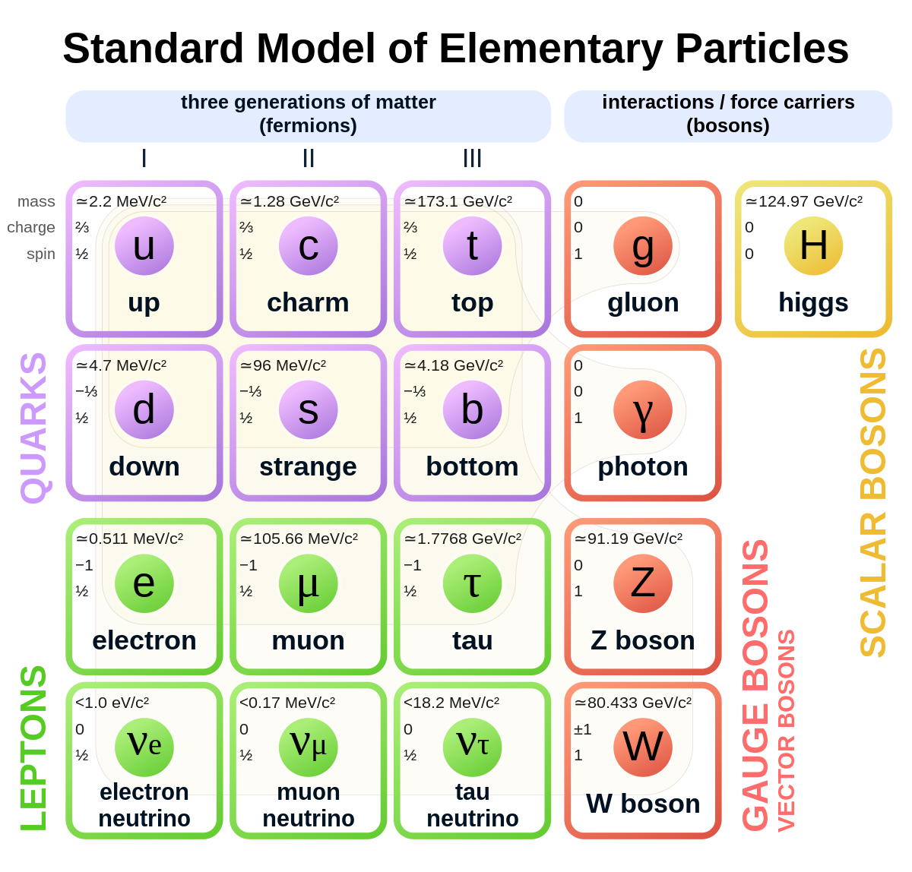
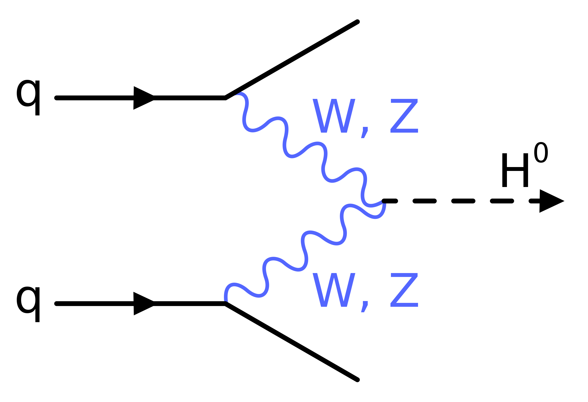
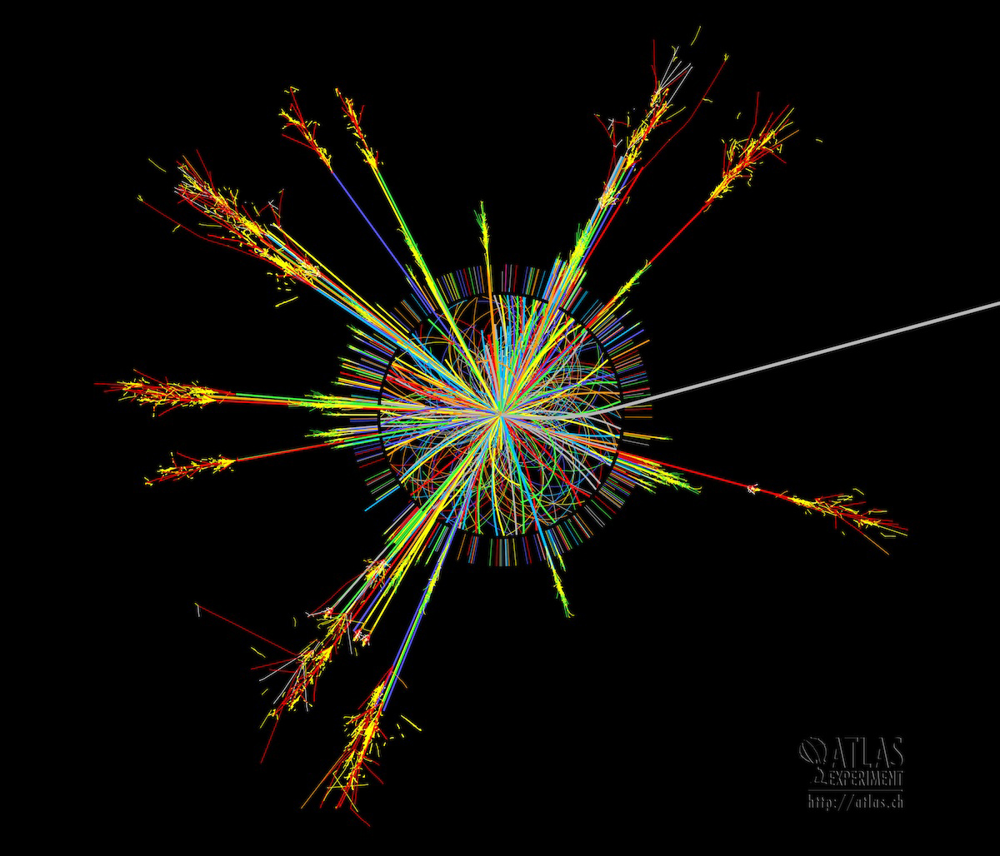

```{r setup, include=FALSE}
knitr::opts_chunk$set(echo = TRUE)
```

```{r imports, include=FALSE}
# Set seed so results are reproducible
seed_num <- 1234

# Imports needed to run the .Rmd file.
library("RCurl")
library("tidyverse") 
library("GGally")
library("caret")
library("car")
library("gridExtra")
library("pROC")
```


# Introduction
## Context
In recent history, particle collision experiments have provided humanity with some of its greatest advancements in scientific knowledge. Probably the most famous of these was in 2012, when scientists at the Large Hardron Collider (LHC) at the CERN laboratory in Geneva, Switzerland, announced that they had discovered [definitive proof of the existence of the Higgs Boson particle](https://arxiv.org/abs/1207.7214). This was a huge achievement in the field of physics, as it gave further validity to the Standard Model of Physics, which to this day remains our best theory to describe the elementary particles of our universe. 

```{r Fig1, echo=FALSE, fig.align='center', out.width='60%', fig.cap='Fig 1: A table representing all the particles in the Standard Model of physics. [Source](https://www.abc.net.au/news/science/2017-07-15/the-standard-model-of-particle-physics-explained/7670338)'}

```

To prove the existence of the Higgs Boson, two detectors at CERN (ATLAS and CMS) analyzed collisions between extremely high energy proton beams generated by the LHC. Collisions between two high energy protons aren't like collisions in the normal sense (such as a bat hitting a ball), but they do share some similarities. In short, during a proton-proton collision, the elementary particles marking up each (two up quarks and one down quark, in this case) can interact with each other in order to form other larger particles, which then decay into their own elementary components. These kinds of interactions can be visualized by Feynman Diagrams, and the rules used to draw them are dictated by conservation laws within a field of physics known as Quantum Chromodynamics.  

```{r Fig2, echo=FALSE, fig.align='center', out.width='60%', fig.cap='Fig 2: A feynman diagram showing a possible interaction during two quarks in a proton-proton collision. In this case the quakrs interact to form either W or Z bosons, which then further interact to emit a Higgs particle. [Source](https://www.wikiwand.com/en/Vector_boson)'}

```


Inside the LHC, the streams of particles that are produced by these interactions are called jets, considering that they all fly in roughly the same direction. 

```{r Fig3, echo=FALSE, fig.align='center', out.width='60%', fig.cap='Fig 3: A visualization of a proton-proton collision from the CERN ATLAS detector, in which ten particle jets are clearly visible. Each line represents a single particle. [Source](https://news.fnal.gov/2014/05/what-is-a-jet/)'}

```

Analysis of one of these types of particle jets, known as $b$-jets, was one of the ways that scientists at CERN were able to prove the existence of the Higgs Boson. $b$-jets are those jets that originate from a bottom quark, which is one of the elementary particles present in a proton. While the Higgs boson's existence has already been proven, scientists hypothesize that there are still a number of other unfounded particles that could still be the result of interactions within a $b$-jet. As such, identifying $b$-jets is of particular importance to particle physics scientists. 

## Purpose

The goal of this project is to use data from proton-proton particle collisions at CERN to determine whether or not there are certain physical characteristics that are more likely to produce $b$-jets. This will be done via a logistic regression methodology, which will be used to predict whether or not a given collision produced a $b$-jet. The data in this project comes from [CERN's open data portal](http://opendata.cern.ch/record/554) by means of [Kaggle](https://www.kaggle.com/datasets/fedesoriano/multijet-primary-dataset?q=CERN), and contains data from 21,726 proton-proton collisions. The data has also been uploaded to [Github](https://raw.githubusercontent.com/williamzjasmine/CUNY_SPS_DS/master/DATA_606/Final_Project/MultiJetRun2010B.csv).

# Data Collection 

The code chunk below imports the data from Github and stores it as an R dataframe, `df`.

```{r get_data, warning=FALSE, message=FALSE}
# load data
link <- getURL("https://raw.githubusercontent.com/williamzjasmine/CUNY_SPS_DS/master/DATA_606/Final_Project/MultiJetRun2010B.csv")
df <- read_csv(link, na=c("", "NA"))
glimpse(df)
```

We see from the above output that the data was imported correctly and that `df` includes all 21,726 proton-proton collisions. The below chart includes a list of all the columns included, as well as a description of each: 

Column Name  | Description
------------- | -------------
`Run` | The run number of the event.
`Lumi` | The lumi section of the event.
`Event` | The event number of the event.
`MR` | First razor kinematic variable, the MR variable is an estimate of an overall mass scale, which in the limit of massless decay products equals the mass of the heavy parent particle.
`Rsq` | Second razor kinematic variable, the Rsq variable is the square of the ratio R, which quantifies the flow of energy in the plane perpendicular to the beam and the partitioning of momentum between visible and invisible particles.
`E1` | Energy of the leading megajet.
`Px1` | x-component of the momentum of the leading megajet.
`Py1` | y-component of the momentum of the leading megajet.
`Pz1` | z-component of the momentum of the leading megajet.
`E2` | Energy of the subleading megajet.
`Px2` | x-component of the momentum of the subleading megajet.
`Py2` | y-component of the momentum of the subleading megajet.
`Pz2` | z-component of the momentum of the subleading megajet.
`HT` | The scalar sum of the transverse momentum of the jets.
`MET` | The magnitude of the vector sum of the transverse energy of the particles in the event.
`nJets` | The number of jets with transverse momentum above 40 GeV.
`nBJets` | The number of b-tagged jets with transverse momentum above 40 GeV.

In this case, our response variable is `nBJets`, which counts the number of $b$-jets present in each collision. 

# Data Cleaning


The first data cleaning step is to remove the `Run`, `Lumi`, and `Event` fields, which appear to be documentation fields used at CERN, and add no predictive value.

```{r}
df <- df %>%
  select(-Run, -Lumi, -Event)
```

Next, the code chunk below checks for any missing data:

```{r}
any(is.na(df))
```

The remaining fields, with the exception of `nBJets`, represent all the possible explanatory fields that we could use to predict our response variable. However, we can use some physics knowledge to weed out some of these fields. 

The `E1`, `Px1`, `Py1`, `Pz1` and `E2`, `Px2`, `Py2`, `Pz2` columns represent  the energy-momentum four vector $p_{\mu}$ of the leading and subleading megajets, respectively. These are the jets that have the largest, and second largest total transverse momentum. This vector can be written as 

$$
\begin{equation}
p_u = (\frac{E}{c}, p_x, p_y, p_z)
\end{equation}
$$

where $c$ is the speed of light and represents the special relatively transformation of the more widely used space-time vector. 

The below plot shows the relationship between each of the momentum components ($p_x$, $p_y$, $p_z$) and the energy $E$ of the leading megajet by means of a scatterplot:

```{r Ep_dot_plots, fig.align='center', out.width='75%', fig.cap='Fig 4: Scatterplot of energy and momentum component values for the leading megajet.'}
axes <- c('x', 'y', 'z')
component_df <- data.frame(matrix(ncol = 3, nrow = 0))
colnames(component_df) <- c('E1', 'P1', 'component')

for (axis in axes) {
  var_name <- paste("P", axis, "1", sep = '')
  tmp <- cbind(df$E1, df[var_name])
  colnames(tmp) <- c('E1', 'P1')
  tmp <- tmp %>% mutate(component = axis)
  component_df <- rbind(component_df, tmp)
}

ggplot(
  data = component_df, 
  aes(x = P1, y = E1, fill = component, color = component), 
) +
  geom_point(
    alpha = 0.35,
    size = 0.5
  ) + 
    labs(
      x = 'Momentum (p)',
      y = 'Energy (E)',
    )

```

Given the structure of the points in the plot above, it is clear that there appears to be a connection between these variables. It turns out that we can use some simpler classical mechanics physics to define this relationship. Given the kinetic energy ($E = \frac{1}{2}mv^2$) and momentum ($p = mv$) of a particle, we can derive the following:

$$
\begin{align}
E &= \frac{1}{2}mv^2 \\
E &= \frac{m^2v^2}{2m} \\
E &= \frac{p^2}{2m}
\end{align}
$$

Since $m$ (mass) is a constant, we see from the above that the energy of the particle is proportional to the square of its momentum ($E \propto p^2$). This proportionality that occurs in classical physics is still present in relativity and quantum mechanics. 

In our case, we can obtain a single scalar $p$ value by using the Pythagorean theorem on our vector components (note we cannot calculate the true scalar value in this case since we lack the angles between the components):

$$
\begin{align}
p^2 &\propto p_x^2+p_y^2+p_z^2 \\
p &\propto \sqrt{p_x^2+p_y^2+p_z^2} 
\end{align}
$$

The figure below calculates these scalar $p$ values against the energy values for both the leading and subleading megajet:

```{r, Ep-fit, fig.align='center', out.width='75%', fig.cap='Fig 5: Relationship between energy and scalar momentum for both leading and subleading megajets. The black line repesents a polynomial fit of degree 2.'}
df <- df %>% 
  mutate(
    P1 = sqrt((Px1 * Px1 + Py1 * Py1 + Pz1 * Pz1)),
    P2 = sqrt((Px2 * Px2 + Py2 * Py2 + Pz2 * Pz2))
  )

P_df1 <- df %>%
  select(E1, P1) %>%
    mutate(jet_type = 'Leading Megajet')
colnames(P_df1) <- c('E', 'P', 'jet_type')
P_df2 <- df %>%
  select(E2, P2) %>%
    mutate(jet_type = 'Subleading Megajet')
colnames(P_df2) <- c('E', 'P', 'jet_type')
P_df <- rbind(P_df1, P_df2)


ggplot(
  data = P_df, 
  aes(x = sqrt(P), y = E, fill = jet_type, color = jet_type), 
) +
  geom_point(
    alpha = 0.5,
    size = 1,
  ) + 
  stat_smooth(
    method = "lm",
    formula = y ~ poly(x, 2),
    se = FALSE,
    color = 'black',
    size = 0.25
  ) +
    labs(
      x = 'Momentum (p)',
      y = 'Energy (E)',
    )
```

Based on the figure above, we can see the how well a quadratic fit aligns to the data, clearly exhibiting the $E \propto p^2$ proportionality mentioned earlier. 

Because these variables have a clear connection with one another, we cannot view them as independent and must remove all but one in order to have cleaner model. This is done in the cell below, which removes all the momentum component variables (leaving only $E1$ and $E2$ as the remaining energy-momentum vector variables):

```{r removeP}
df <- df %>%
  select(-contains('P'))
```

To perform the next data cleaning step, the cell below creates dot plots of all pairs of remaining independent variables: 

```{r plotpairsv1, fig.align='center', out.width='100%', fig.cap='Fig 6: Scatter plots for all remaining independent variables.'}
df %>%
  select(-contains('P'), -contains('Jet')) %>%
    ggpairs(axisLabels = 'none')
```

We can see that there are a number of variables that do exhibit some high correlation values, which are visually evidenced in the scatterplots. The two variables that appear to be driving the highest correlation values (`Rsq` and `MR`) are removed in the cell below:

```{r remove-colinear-vars}
df <- df %>%
  select(-MR, -Rsq)
```

We can now recreate the all the remaining scatterplots:

```{r plotpairsv2, fig.align='center', out.width='100%', fig.cap='Fig 7: Scatter plots for all remaining independent variables with MR and Rsq variables removed.'}
df %>%
  select(-contains('P'), -contains('Jet')) %>%
    ggpairs(axisLabels = 'none')
```

These correlation values seem to be within a reasonable means to include in our forthcoming analysis and modelling.

# Data Analysis

Now that we have settled on a final set of independent variables, we can perform some exploratory data analysis to get a better look at our data. 

The code chunk below provides summary statistics for all the fields in `df`:

```{r df-summary}
summary(df)
```

Next, the cell below shows the distribution of the number of $b$-jets in each collision.

```{r bjets_dist, fig.align='center', out.width='75%', fig.cap='Fig 8: Distribution of the number of b-jets in each collision.'}
ggplot(data = df, aes(x = nBJets)) +
  geom_histogram(bins = length(unique(df$nBJets))) + 
    labs(
      x = 'Number of b-Jets',
      y = 'Count',
    )
```

As is clear from the data above, $b$-jets are pretty rare in the particle collisions included in our dataset. Most collisions have none, and the most $b$-jets observed in a single collision is two. Given this distribution, it makes sense to transform our response variable into a binary variable `BJet` such that `BJet = 1` if a collision produced and $b$-jet, and `Bjet` = 0 if not. This is done in the cell below:

```{r transform-response-variable}
df <- df %>% 
  mutate(BJet = ifelse(nBJets >= 1, 1, 0))
```

Next, the cell below shows the distribution of `nJets`, to see how it compares to the distribution in Fig 8. 

```{r njets_dist, fig.align='center', out.width='75%', fig.cap='Fig 9: Distribution of the number of jets in each collision.'}
ggplot(data = df, aes(x = nJets)) +
  geom_histogram(bins = length(unique(df$nJets))) + 
    labs(
      x = 'Number of Jets in collision',
      y = 'Count of Collisions'
    )
```

As we can see from the distribution, each collision has at least two jets (which makes sense, given a collision requires there be at least one interaction), but that there are never more than 6. 

The cell below determines exactly just how rare these $b$-jets are:

```{r bjet-proportions}
pBJet <- round((sum(df$nBJets) / sum(df$nJets)) * 100, digits = 2)
pBJet_c <- round((sum(df$BJet) / nrow(df)) * 100, digits = 2)
nBJet <- unname(table(df$BJet))[2]
```

**Percentage of observed particle jets that were $b$-jets =** `r pBJet`% <br/>
**Percentage of collisions that observed a $b$-jet =** `r pBJet_c`% <br/>
**Number of collisions that observed a $b$-jet = ** `r nBJet`

# Modelling 
## Create Initial Model

Given the binary nature of the response variable, we will use logistic regression to attempt to predict if a collision results in a $b$-jet. The code chunk below creates a logistic model using data from all the collisions in `df`: 

```{r inital-model}
model <- glm(BJet ~ E1 + E2 + HT + MET, family=binomial(link='logit'), data=df)
summary(model)
```

Before we go about analyzing performance and making predictions, we will use this initial model to perform diagnostics and check all of our assumptions for logistic regression. 

## Assumptions
### Independent Observations

Each of the rows in our dataset represent data from individual collisions and the results of one collision have no effect on the results of another. As such, we can conclude each collision is independent and this assumption is satisfied.

### No Multicollinearity Among Explanatory Variables 

While this was in a sense already checked in our data analysis section by observing Fig 7, we can use our initial model to calculate the variance inflation factor (VIF) values for each explanatory variable to further confirm this condition is satisfied. for multicollinearity:

```{r get-vif}
vif(model)
```

VIF numbers provide a quantitative measure of how much one explanatory variable is correlated to any others, [and typically any value below 2.5 is low enough for the lack of multicollinearity assumption to be met](https://www.ncbi.nlm.nih.gov/pmc/articles/PMC5993839/). The output above shows that this is the case for all of our independent variables.

### No Extreme Outliers

The next condition for logistic regression is that the independent variables contain no extreme outliers. We first check this using the simple definition that an outlier is any value that is 1.5 times the IQR over the third quartile or 1.5 times the IQR below the first quartile. This is done in the cell below for each of our independent variables.

```{r check-outliers-iqr}
col_check = c()
loop_data = select(df, E1, E2, HT, MET)

for(i in 1:ncol(loop_data)) {       
  col_data <- as.matrix(loop_data[ , i])
  iqr <- IQR(col_data)
  q1 <- unname(quantile(col_data))[2]
  q3 <- unname(quantile(col_data))[4]
  outliers <- 
    any(
      col_data > (1.5 * iqr) + q3 |
      col_data < q1 - (1.5 * iqr)
    )
  col_check <- append(col_check, outliers)
}

col_check
```

By this definition, each of our four columns have outliers. As such, we can use our  model to remove these points by calculating Cook's Distance. Cook's distance is a metric that is used to determine how much influence a single data point holds over a model's performance [by measuring how that model's predicted values would change if it didn't exist](https://www.jstor.org/stable/1268249). As such, it can be used to identify and remove problematic outliers. Typically, the threshold used for removal is if Cook's distance is greater than $\frac{4}{n}$, where $n$ is the number of observations in our dataset. The plot below shows the cook's distance for all of the observations in our training set:

```{r check-outliers-cook, warning=FALSE, fig.align='center', out.width='75%', fig.cap='Fig 10: Cook distance plotted for all observations. The line represents the 4 / n threshold, over which any observation is considered an outlier.'}
cooksD <- cooks.distance(model)
cooks <- as.data.frame(cooksD)
colnames(cooks) <- c('d_c')
cooks$row_num <- seq.int(nrow(cooks)) 

ggplot(data = cooks, aes(x = row_num, y = d_c)) + 
  geom_point(size =  1) +
    geom_hline(yintercept = 4 / nrow(df), color = "red") +
      labs(
        x = "Index",
        y = "Cook's Distance"
      ) + 
        ylim(0, 0.002)
```

As is clear from the plot above, the data seems grouped into a two distinct sets, with one of those containing a large number of outliers. To do further analyses on these points, we can separate our data into two new dataframes `outlier_df`, `no_outlier_df`:

```{r split-outliers}
influential_obs <- as.numeric(names(cooksD)[(cooksD > (4/nrow(df)))])
no_outliers_df <- df[-influential_obs, ]
outliers_df <- df[influential_obs, ]

nrow(outliers_df)
```

The output above shows that using the Cook's distance methodology, 1,140 outliers have been identified. However, when we look at the counts of the response variable in each of these newly created dataframes:

```{r show-outliers-split}
table(no_outliers_df$BJet)
table(outliers_df$BJet)
```

we see that the outliers dataframe includes almost every single collision in which there was a $b$-jet. As such, we should not remove these outliers when creating our model so that it can still have predictive power. 

### Linear Relationship Between Explanatory Variables and the Logit of the Response Variable 

To ensure this condition is met, the cell below calculates the log odds of each of the probabilities determined by the model. Given a probability $p$, the log odds or logit of $p$ are: 

$$
\begin{equation}
\text{logit}(p) = \log \left( \frac{p}{1-p} \right)
\end{equation}
$$

These logit values are plotted below in scatter plots with each of our independent variables: 

```{r logit-plots, message=FALSE, fig.align='center', out.width='75%', fig.cap='Fig 11: Plots of the logit of the response variable (BJet) as a function of each of the independent variables.'}
probs <- predict(model, type = 'response')

logit <- log(probs/(1-probs))

E1_plot <-
  ggplot(data = df, aes(x = logit, y = E1)) + 
    geom_point() +
      geom_smooth(method = 'lm') + 
        labs(
          x = 'Logit',
          y = 'E1'
        ) + 
          theme(
            axis.text.x=element_blank(),
            axis.text.y=element_blank()
          )
E2_plot <-
  ggplot(data = df, aes(x = logit, y = E2)) + 
    geom_point() +
      geom_smooth(method = 'lm') +         
        labs(
          x = 'Logit',
          y = 'E2'
        ) + 
          theme(
            axis.text.x=element_blank(),
            axis.text.y=element_blank()
          )
HT_plot <-
  ggplot(data = df, aes(x = logit, y = HT)) + 
    geom_point() +
      geom_smooth(method = 'lm') + 
        labs(
          x = 'Logit',
          y = 'HT'
        ) + 
          theme(
            axis.text.x=element_blank(),
            axis.text.y=element_blank()
          )
MET_plot <-
  ggplot(data = df, aes(x = logit, y = MET)) + 
    geom_point() +
      geom_smooth(method = 'lm') + 
        labs(
          x = 'Logit',
          y = 'MET'
        ) + 
          theme(
            axis.text.x=element_blank(),
            axis.text.y=element_blank()
          )

grid.arrange(E1_plot, E2_plot, HT_plot, MET_plot, ncol=2, nrow=2)
```

While the linearity isn't overwhelming for the `E1` and `E2` fields, there is still an evident negative correlation in each. In all cases, the apparent linearity is clear enough to warrant this assumption as valid. 

### Sample Size is Sufficiently Large

Logistic regression typically requires there to be at least 10 cases of the least frequent outcome. As mentioned earlier, there are 1,111 cases in which the rare `BJets` are present during a particle collision, more than enough needed to satisfy this condition. 

## Fine Tune Model
### Train Test Split

Now that we have used an "out of the box" model generated from all collision data to establish that our logistic regression assumptions are met, we can recreate the model with a training and test set to try and make some predictions and evaluate its performance. The code chunk below performs this split:

```{r train-test-split}
set.seed(seed_num)

sample <- sample(c(TRUE, FALSE), nrow(df), replace=TRUE, prob=c(0.7,0.3))
train <- df[sample, ]
test <- df[!sample, ]  

x_train <- train %>%
  select(-contains('Jet')) 
y_train <- train %>%
  select(BJet) %>% as.matrix() %>%
    factor(levels = c(1, 0), labels = c(1, 0))

x_test <- test %>%
  select(-contains('Jet'))
y_test <- test %>%
  select(BJet)  %>% as.matrix() %>%
    factor(levels = c(1, 0), labels = c(1, 0))
```

### First Model Attempt

The cell below creates a new model `m1` using only the training data, and prints a summary:

```{r create-m1}
m1 <- glm(
  BJet ~ E1 + E2 + HT + MET, family=binomial(link='logit'), 
  data=train
)
summary(m1)
```

From the output above, we see that each of our explanatory variables was a statistically significant predictor of `BJets` as the parameter estimates for each had $p$ values below 0.001. To get meaning out of these parameter estimates, we can exponentiate them:

```{r calc-odds}
E1_odds <- exp(unname(coefficients(m1))[2])
E2_odds <- exp(unname(coefficients(m1))[3])
HT_odds <- exp(unname(coefficients(m1))[4])
MET_odds <- exp(unname(coefficients(m1))[5])
```

The values calculated in the cell above represent odds, and can be interpreted as follows: 

* **For every unit increase in `E1`, the odds of a collision producing a $b$-jet are multiplied by `r E1_odds`.**
* **For every unit increase in `E2`, the odds of a collision producing a $b$-jet are multiplied by `r E2_odds`.**
* **For every unit increase in `HT`, the odds of a collision producing a $b$-jet are multiplied by `r HT_odds`.**
* **For every unit increase in `MET`, the odds of a collision producing a $b$-jet are multiplied by `r MET_odds`.**

Thus, those collisions with lower `E1` and `E2` values, and larger `HT` and `MET` values are those most likely to produce a $b$-jet. Note that because the scale and range of our independent variables are quite large, the odds are all very close to 1, and thus don't have a large impact for a single unit change. However, these odds will compound as the variables continue to increase or decrease. 

Next, we can finally check the predictive power of the model. The cell below creates predictions and compares them against those contained in `y_test` to produce a confusion matrix. 

```{r cm-for-m1, warning=FALSE}
y_pred <- predict(m1, x_test, type='response') 
y_pred_df <- y_pred %>%
    as.data.frame() %>%
      mutate(class = ifelse(. > 0.5, 1, 0))
colnames(y_pred_df) <- c('prob', 'class')

y_pred_class <- y_pred_df %>%
  select(class) %>% as.matrix() %>%
    factor(labels = c(0, 1))

caret::confusionMatrix(y_pred_class, y_test)

```

Based on the results of the confusion matrix, we see that there's a glaring problem: the model has extremely high accuracy, but this is only because it predicted every collision as not producing a $b$-jet (except for 1). Since the incidence of $b$-jets is low, the high accuracy is a misleading metric to use. More informative is the sensitivity value of 0, indicating that there is not a single true positive value and that we should not have confidence in this model's ability to identify collisions that produce $b$-jets. One possible fix we can make is to change the cutoff probability used to categorize a collision as having a $b$-jet. The results shown above used a cutoff of 0.5, but manipulating this value can have a positive effect on the model. 

The cell below calculates the sensitivity (recall) and precision ("Pos Pred Value") of the predictions made by `m1` using a range of cutoff probabilities, and plots them on a graph:

```{r cutoff-plot, warning=FALSE, fig.align='center', out.width='75%', fig.cap='Fig 12: The recall and precision metrics of the predictions made by model m1 change for different probability cuttoffs.'}
cutoffs <- seq(0.01, 0.5, by=0.001)
precs <- c()
sents <- c()

for (cutoff in cutoffs) {
  y_pred_df_tmp <- y_pred %>%
    as.data.frame() %>%
      mutate(class = ifelse(. > cutoff, 1, 0))
  colnames(y_pred_df_tmp) <- c('prob', 'class')
  
  if (length(unique(y_pred_df_tmp$class)) > 1) {
    y_pred_class_tmp <- y_pred_df_tmp %>%
      select(class) %>% as.matrix() %>%
        factor(levels = c(1, 0), labels = c(1, 0))
    
    
    prec_tmp <- precision(y_pred_class_tmp, y_test)
    sent_tmp <- sensitivity(y_pred_class_tmp, y_test)

    precs <- append(precs, prec_tmp)
    sents <- append(sents, sent_tmp)

  }
  else {
    specs <- append(specs, NULL)
    sents <- append(sents, NULL)

  }
  
}

plt_data1 <- as.data.frame(cbind(head(cutoffs, -1), precs))
colnames(plt_data1) <- c('cutoff', 'metric_value')
plt_data1$metric = 'precision'

plt_data2 <- as.data.frame(cbind(head(cutoffs, -1), sents))
colnames(plt_data2) <- c('cutoff', 'metric_value')
plt_data2$metric = 'recall'

plt_data <- rbind(plt_data1, plt_data2)

ggplot(data = plt_data, 
       aes(x = cutoff, y = metric_value, fill = metric, color = metric)
      ) +
  geom_point(size = 0.25) + 
    labs(
      x = 'Probability Cutoff',
      y = 'Metric Value'
    )
```

As is clear from the output above, the precision never gets very high, which meaning that for all thresholds many of the positive predictions made will be false positives. However, if the goal is to capture a solid portion of the collisions that result in $b$-jets, we can excuse this low precision by having a decent recall value. The threshold at which the model captures ~75% of all the $b$-jet collisions is calculated below, which is then used to create a new confusion matrix:


```{r recreate-cm-m1}
i <- 1
p_cutoff <- 0
recall <- 1

while(recall > 0.75) {
  row <- filter(plt_data, metric == 'recall')[i, ]
  p_cutoff <- unname(row$cutoff)
  recall <- unname(row$metric_value)
  i <- i + 1
}

y_pred <- predict(m1, x_test, type='response') 
y_pred_df <- y_pred %>%
    as.data.frame() %>%
      mutate(class = ifelse(. > p_cutoff, 1, 0))
colnames(y_pred_df) <- c('prob', 'class')

y_pred_class <- y_pred_df %>%
  select(class) %>% as.matrix() %>%
    factor(levels = c(1, 0), labels = c(1, 0))

caret::confusionMatrix(y_pred_class, y_test)
```

The new probability threshold in this case is `r p_cutoff`, and we can see that the recall is indeed very close to 75%: out of the 346 collisions that had $b$-jets, the model with this updated probability threshold was able to correctly identify 259 of them. However, the model is still far from perfect: it also incorrectly identified 3,967 collisions as having $b$-jets when there was none. 

### Second Model Attempt

Another possible improvement we can add to our model is to include class weights when training the model. Since our data is so imbalanced, we can weight those collisions that don't produce $b$-jets to have less influence in the training process. While there are many different kinds of weighting methodologies, we choose here to simply give each observation a weight equal to one minus the proportion that the pertinent class appears in the dataset. In this case, since only around 5% of the collisions in the training data produced $b$-jets, those observations would receive a weight of ~0.95. Subsequently, all the collisions that did not produce $b$-jets receive a weighting of ~0.05. 

```{r create-m2, warning=FALSE}
wt1 <- unname(table(y_train))[2] / nrow(x_train)
wt0 <- unname(table(y_train))[1] / nrow(x_train)

wts <- as.data.frame(y_train) %>% 
  mutate(weight = ifelse(y_train == 1, wt1, wt0))
wts <- wts %>%
  select(weight) %>% as.matrix()

m2 <- glm(
  BJet ~ E1 + E2 + HT + MET, 
  family=binomial(link='logit'), 
  data=train,
  weights = wts
)
summary(m2)
```

In this case we can use the AIC to quickly compare `m1` and `m2` and note this this new model has a significantly lower value. This bodes well, as lower AIC values tend to indicate better logistic regression models when compared to one another. In addition, each of our explanatory variables remains a statistically significant predictor of `BJet`. 

The cell below uses our new model to create a new set of predictions and compares them to those from `y_test` via a confusion matrix.

```{r cm-m2}
y_pred <- predict(m2, x_test, type='response') 
y_pred_df <- y_pred %>%
    as.data.frame() %>%
      mutate(class = ifelse(. > 0.5, 1, 0))
colnames(y_pred_df) <- c('prob', 'class')

y_pred_class <- y_pred_df %>%
  select(class) %>% as.matrix() %>%
    factor(levels = c(1, 0), labels = c(1, 0))

confusionMatrix(y_pred_class, y_test)
```

The addition of class weights clearly caused a performance increase in our model, as we do not need to manipulate the probability cutoffs in order for the model to produce a positive prediction. However, we are still plagued by similar issues: while this model captures ~55% of all the collisions that produced $b$-jets, only ~6.6% of the positive predictions it made were true positives. 

To get a final measure of the model's performance, we can plot an ROC curve:

```{r roc-cuve, message=FALSE, fig.align='center', out.width='75%', fig.cap='Fig 13: ROC curve for model m2. AUC = 0.5847.'}

# create ROC curve
roc(y_test ~ y_pred, plot = TRUE)
```

# Conclusion 

While the models created above were able to identify a decent number of those collisions that produced $b$-jets, they suffered from extremely low precision. The 6.5% precision value throws a wrench in the model's ability to save a scientist time, given that as a whole 5% of the collisions included in the dataset produced $b$-jets. With or without using the model, they would still need to evaluate a large number of collisions to find those that produced $b$-jets. However, it is possible that with additional data these low precision values could be improved, making the model's use more viable. 

It is also worth noting that the identification of outliers via Cook's distance included almost every single collision that observed a $b$-jet, and no others. The cell below shows the confusion matrix if our predictions were made via outlier identification from a Cook's distance methodology (in which Cook's distance > $\frac{4}{n}$):

```{r}
df$cd <- cooksD
df <- df %>%
  mutate(cd_pred = ifelse(cd > 4 / nrow(df), 1, 0))

confusionMatrix(
  factor(as.matrix(df$cd_pred), levels = c(1, 0), labels = c(1, 0)),
  factor(as.matrix(df$BJet), levels = c(1, 0), labels = c(1, 0))
)
```

While these metrics didn't come from the use of a classifier, they are quite impressive (almost perfect) and as such this methodology might be considered useful in the identification of $b$-jets.