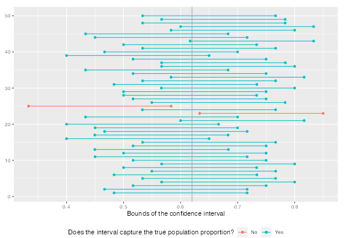
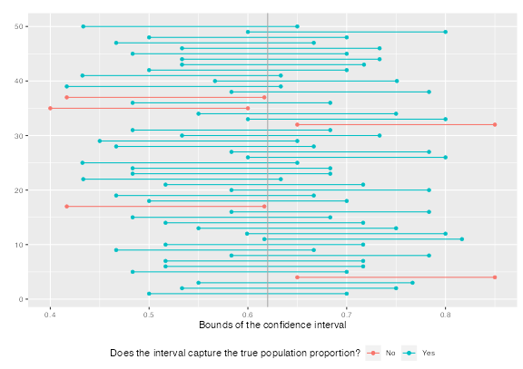

```{r global_options, include=FALSE}
knitr::opts_chunk$set(eval = TRUE, message = FALSE, warning = FALSE)
```

If you have access to data on an entire population, say the opinion of every adult in the United States on whether or not they think climate change is affecting their local community, it's straightforward to answer questions like, "What percent of US adults think climate change is affecting their local community?". Similarly, if you had demographic information on the population you could examine how, if at all, this opinion varies among young and old adults and adults with different leanings. If you have access to only a sample of the population, as is often the case, the task becomes more complicated. What is your best guess for this proportion if you only have data from a small sample of adults? This type of situation requires that you use your sample to make inference on what your population looks like.

<div id="boxedtext">
**Setting a seed:** You will take random samples and build sampling distributions in this lab, which means you should set a seed on top of your lab. If this concept is new to you, review the lab on probability.
</div>

## Getting Started

### Load packages

In this lab, we will explore and visualize the data using the **tidyverse** suite of packages, and perform statistical inference using **infer**.

Let's load the packages.

```{r load-packages, message=FALSE}
library(tidyverse)
library(openintro)
library(infer)
library("png")
seed <- 1234
```

### The data

A 2019 Pew Research report states the following:

To keep our computation simple, we will assume a total population size of 100,000 (even though that's smaller than the population size of all US adults).

> Roughly six-in-ten U.S. adults (62%) say climate change is currently affecting their local community either a great deal or some, according to a new Pew Research Center survey.
>
>**Source:** [Most Americans say climate change impacts their community, but effects vary by region](https://www.pewresearch.org/fact-tank/2019/12/02/most-americans-say-climate-change-impacts-their-community-but-effects-vary-by-region/)

In this lab, you will assume this 62% is a true population proportion and learn about how sample proportions can vary from sample to sample by taking smaller samples from the population. We will first create our population assuming a population size of 100,000. This means 62,000 (62%) of the adult population think climate change impacts their community, and the remaining 38,000 does not think so.

```{r}
us_adults <- tibble(
  climate_change_affects = c(rep("Yes", 62000), rep("No", 38000))
)
```

The name of the data frame is `us_adults` and the name of the variable that contains responses to the question *"Do you think climate change is affecting your local community?"* is `climate_change_affects`.

We can quickly visualize the distribution of these responses using a bar plot.

```{r bar-plot-pop, fig.height=2.5, fig.width=10}
ggplot(us_adults, aes(x = climate_change_affects)) +
  geom_bar() +
  labs(
    x = "", y = "",
    title = "Do you think climate change is affecting your local community?"
  ) +
  coord_flip() 
```

We can also obtain summary statistics to confirm we constructed the data frame correctly.

```{r summ-stat-pop, results = TRUE}
us_adults %>%
  count(climate_change_affects) %>%
  mutate(p = n /sum(n))
```

In this lab, you'll start with a simple random sample of size 60 from the population.

```{r sample}
set.seed(seed)

n <- 60
samp <- us_adults %>%
  sample_n(size = n)
```

1.  What percent of the adults in your sample think climate change affects their 
    local community? **Hint:** Just like we did with the population, we can calculate 
    the proportion of those **in this sample** who think climate change affects their 
    local community.
    
---

**WJ Response**:

```{r}
samp %>%
  count(climate_change_affects) %>%
  mutate(p = n /sum(n))

```

According to the output above, 61.7% of adults (37 out of 60) in the sample `samp` think that climate change affects their local community. 

---

2.  Would you expect another student's sample proportion to be identical to yours? 
    Would you expect it to be similar? Why or why not?

---

**WJ Response**:

No, I would not expect the another student's sample to be identical (though, there is a small chance it could be), but I would expect them to be similar given that each sample randomly selects values from the same `us_adults` dataframe.

---

## Confidence intervals

Return for a moment to the question that first motivated this lab: based on this sample, what can you infer about the population? With just one sample, the best estimate of the proportion of US adults who think climate change affects their local community would be the sample proportion, usually denoted as $\hat{p}$ (here we are calling it `p_hat`). That serves as a good **point estimate**, but it would be useful to also communicate how uncertain you are of that estimate. This uncertainty can be quantified using a **confidence interval**.

One way of calculating a confidence interval for a population proportion is based on the Central Limit Theorem, as $\hat{p} \pm z^\star SE_{\hat{p}}$ is, or more precisely, as \[ \hat{p} \pm z^\star \sqrt{ \frac{\hat{p} (1-\hat{p})}{n} } \]

Another way is using simulation, or to be more specific, using **bootstrapping**. The term **bootstrapping** comes from the phrase "pulling oneself up by one's bootstraps", which is a metaphor for accomplishing an impossible task without any outside help. In this case the impossible task is estimating a population parameter (the unknown population proportion), and we'll accomplish it using data from only the given sample. Note that this notion of saying something about a population parameter using only information from an observed sample is the crux of statistical inference, it is not limited to bootstrapping. 

In essence, bootstrapping assumes that there are more of observations in the populations like the ones in the observed sample. So we "reconstruct" the population by resampling from our sample, with replacement. The bootstrapping scheme is as follows:

- **Step 1.** Take a bootstrap sample - a random sample taken **with replacement** from the original sample, of the same size as the original sample.
- **Step 2.** Calculate the bootstrap statistic - a statistic such as mean, median, proportion, slope, etc. computed on the bootstrap samples.
- **Step 3.** Repeat steps (1) and (2) many times to create a bootstrap distribution - a distribution of bootstrap statistics.
- **Step 4.** Calculate the bounds of the XX% confidence interval as the middle XX% j knof the bootstrap distribution.

Instead of coding up each of these steps, we will construct confidence intervals using the **infer** package.

Below is an overview of the functions we will use to construct this confidence interval:

Function    | Purpose
----------- | -------
`specify`   | Identify your variable of interest
`generate`  | The number of samples you want to generate
`calculate` | The sample statistic you want to do inference with, or you can also think of this as the population parameter you want to do inference for
`get_ci`    | Find the confidence interval

This code will find the 95 percent confidence interval for proportion of US adults who think climate change affects their local community.

```{r confidence interval infer}
set.seed(seed)

samp %>%
  specify(response = climate_change_affects, success = "Yes") %>%
  generate(reps = 1000, type = "bootstrap") %>%
  calculate(stat = "prop") %>%
  get_ci(level = 0.95)
```

- In `specify` we specify the `response` variable and the level of that variable we are calling a `success`.
- In `generate` we provide the number of resamples we want from the population in the `reps` argument (this should be a reasonably large number) as well as the type of resampling we want to do, which is `"bootstrap"` in the case of constructing a confidence interval.
- Then, we `calculate` the sample statistic of interest for each of these resamples, which is `prop`ortion.

Feel free to test out the rest of the arguments for these functions, since these commands will be used together to calculate confidence intervals and solve inference problems for the rest of the semester. But we will also walk you through more examples in future chapters.

To recap: even though we don't know what the full population looks like, we're 95% confident that the true proportion of US adults who think climate change affects their local community is between the two bounds reported as result of this pipeline.

## Confidence levels

3.  In the interpretation above, we used the phrase "95% confident". What does "95% confidence" mean? In this case, you have the rare luxury of knowing the true population proportion (62%) since you have data on the entire population. 

---

**WJ Response**:

In this case the 95% confidence interval means that if we took 100 random samples of U.S. adults and surveyed them as to whether or not we think climate change affects their local community, that we can expect 95 of those samples to have the percentage of number of people who think it does fall between 50% and 75%.


---

4.  Does your confidence interval capture the true population proportion of US adults 
    who think climate change affects their local community? If you are working on this 
    lab in a classroom, does your neighbor's interval capture this value? 

---

**WJ Response**:

Yes, the confidence interval captures an estimate of the population proportion as a result of the bootstrapping process. If we didn't know that the actual population proportion was 62%, we could use the confidence interval above to approximate it to a reasonable degree of accuracy (between 50% and 75%). These confidence interval values might change with subsequent runs of the program (either by someone else or with a different seed), due to the random nature of the bootstrapping process, but only slightly and should still always provide a close estimate.

---

5.  Each student should have gotten a slightly different confidence interval. What 
    proportion of those intervals would you expect to capture the true population 
    proportion? Why?
    
---

**WJ Response**:

It would very strange if not 100% of these different confidence intervals captured the true population proportion. In order for this to happen for a single bootstrap calculation, during the bootstrap process each of the 2,000 samples would have needed to have sample proportions that were either all above or all below the population proportion. The chance of this happening is technically possible, but given the number of samples run along with the relatively high sample size it would require a close to miracle.

---

In the next part of the lab, you will collect many samples to learn more about how sample proportions and confidence intervals constructed based on those samples vary from one sample to another.

-   Obtain a random sample.
-   Calculate the sample proportion, and use these to calculate and store the lower and upper bounds of the confidence intervals.
-   Repeat these steps 50 times.

Doing this would require learning programming concepts like iteration so that you can automate repeating running the code you've developed so far many times to obtain many (50) confidence intervals. In order to keep the programming simpler, we are providing the interactive app below that basically does this for you and created a plot similar to Figure 5.6 on [OpenIntro Statistics, 4th Edition (page 182)](https://www.openintro.org/os).

```{r shiny, echo=FALSE, eval=FALSE, results = TRUE}
# This R chunk will only run in interactive mode
store_ci <- function(i, n, reps, conf_level, success) {
  us_adults %>%
    sample_n(size = n) %>%
    specify(response = climate_change_affects, success = success) %>%
    generate(reps, type = "bootstrap") %>%
    calculate(stat = "prop") %>%
    get_ci(level = conf_level) %>%
    rename(
      x_lower = names(.)[1],
      x_upper = names(.)[2]
    )
}
library(shiny)
shinyApp(
  ui <- fluidPage(
    h4("Confidence intervals for the proportion of US adults who think 
     climate change"),

    h4(selectInput("success", "",
      choices = c(
        "is affecting their local community" = "Yes",
        "is not affecting their local community" = "No"
      ),
      selected = "Yes", width = "50%"
    )),

    # Sidebar with a slider input for number of bins
    sidebarLayout(
      sidebarPanel(
        numericInput("n_samp",
          "Sample size for a single sample from the population:",
          min = 1,
          max = 1000,
          value = 60
        ),

        hr(),

        numericInput("n_rep",
          "Number of resamples for each bootstrap confidence interval:",
          min = 1,
          max = 15000,
          value = 1000
        ),

        numericInput("conf_level",
          "Confidence level",
          min = 0.01,
          max = 0.99,
          value = 0.95,
          step = 0.05
        ),

        hr(),

        radioButtons("n_ci",
          "Number of confidence intervals:",
          choices = c(10, 25, 50, 100),
          selected = 50, inline = TRUE
        ),

        actionButton("go", "Go")
      ),

      # Show a plot of the generated distribution
      mainPanel(
        plotOutput("ci_plot")
      )
    )
  ),

  server <- function(input, output) {

    # set true p
    p <- reactive(ifelse(input$success == "Yes", 0.62, 0.38))

    # create df_ci when go button is pushed
    df_ci <- eventReactive(input$go, {
      map_dfr(1:input$n_ci, store_ci,
        n = input$n_samp,
        reps = input$n_rep, conf_level = input$conf_level,
        success = input$success
      ) %>%
        mutate(
          y_lower = 1:input$n_ci,
          y_upper = 1:input$n_ci,
          capture_p = ifelse(x_lower < p() & x_upper > p(), "Yes", "No")
        )
    })

    # plot df_ci
    output$ci_plot <- renderPlot({
      ggplot(df_ci()) +
        geom_segment(aes(x = x_lower, y = y_lower, xend = x_upper, yend = y_upper, color = capture_p)) +
        geom_point(aes(x = x_lower, y = y_lower, color = capture_p)) +
        geom_point(aes(x = x_upper, y = y_upper, color = capture_p)) +
        geom_vline(xintercept = p(), color = "darkgray") +
        labs(
          y = "", x = "Bounds of the confidence interval",
          color = "Does the interval capture the true population proportion?"
        ) +
        theme(legend.position = "bottom")
    })
  },
  options = list(height = 700)
)
```


6.  Given a sample size of 60, 1000 bootstrap samples for each interval, and 50 
    confidence intervals constructed (the default values for the above app), what 
    proportion of your confidence intervals include the true population proportion? 
    Is this proportion exactly equal to the confidence level? If not, explain why. 
    Make sure to include your plot in your answer.

---

**WJ Response**:

According to the shiny app, it appears as though the percentage of confidence intervals that include the true statistic is equal to the level used for the confidence interval itself. For example, when using the shiny app at a 95% confidence level for 50 calculated intervals, there are typically about 2 or 3 of them that do not include the actual population proportion. This can be seen in the screenshot below: 

However, I am still a bit confused by this (it contradicts my previous answer) as I feel this requires all the bootstrap samples in a single run to be either above or below the true statistic. I have tried replicating this in the code below and have been unable to get the same results as the simulation, as it always says all of the confidence intervals capture the true statistic. 

```{r}

true_prop = 0.62
num_in = 0
num_out = 0

for (x in 1:1000) {
#while (ci_lower <  0.62 & 0.62 < ci_higher) {
  
  sampling <- 
    samp %>%
      specify(response = climate_change_affects, success = "Yes") %>%
      generate(reps = 60, type = "bootstrap") %>%
      calculate(stat = "prop")

  ci_tmp <- get_ci(sampling, level=0.95)
  ci_lower <- ci_tmp$lower_ci[1]
  ci_higher <- ci_tmp$upper_ci[1]

  if (ci_higher < true_prop | ci_lower > true_prop){
    num_out = num_out + 1
  }
  else {
    num_in = num_in + 1
  }
}

print(num_in)
print(num_out)


```

If this is something we could review further in class I would greatly appreciate it :) 

---

* * *

## More Practice

7.  Choose a different confidence level than 95%. Would you expect a confidence 
    interval at this level to me wider or narrower than the confidence interval 
    you calculated at the 95% confidence level? Explain your reasoning.

---

**WJ Response**:

I chose to use a 99% percent confidence interval as opposed to 95%. Before actually running the simulation, I hypothesized that the confidence interval would be wider. This is due to the fact that the confidence interval needs to include the true statistic 99 times out of a 100 in this case, as opposed to only 95. This is a less stringent requirement, meaning that a wider net can be cast to catch all possible values. 

---

8.  Using code from the **infer** package and data from the one sample you have 
    (`samp`), find a confidence interval for the proportion 
    of US Adults who think climate change is affecting their local community with a 
    confidence level of your choosing (other than 95%) and interpret it.
    
---

**WJ Response**:

```{r}
set.seed(seed)

samp %>%
  specify(response = climate_change_affects, success = "Yes") %>%
  generate(reps = 1000, type = "bootstrap") %>%
  calculate(stat = "prop") %>%
  get_ci(level = 0.99)
```

Using a 99% confidence interval, we see that is indeed wider than the original 95% confidence interval used (0.5-0.75 --> 0.45 - 0.783). This means that if we took 100 random samples of U.S. adults and surveyed them as to whether or not we think climate change affects their local community, that we can expect 99 of those samples to have the percentage of number of people who think it does fall between 45% and 78.3%.

---

9.  Using the app, calculate 50 confidence intervals at the confidence level you chose 
    in the previous question, and plot all intervals on one plot, and calculate 
    the proportion of intervals that include the true population proportion. 
    How does this percentage compare to the confidence level selected for the 
    intervals?

---

**WJ Response**:

If using a 99% level when calculating 50 confidence levels, we can only expect on average 0.5 of them to not include the true population statistic. Because of this small value I switched my confidence level to 90%, in which we can expect around 5 of the 50 to not capture the true population proportion. This was confirmed by running the shiny app numerous time. One of those runs is shown below: 

---
    
10.  Lastly, try one more (different) confidence level. First, state how you expect the
    width of this interval to compare to previous ones you calculated. Then, 
    calculate the bounds of the interval using the **infer** package and data 
    from `samp` and interpret it. Finally, use the app to generate many intervals 
    and calculate the proportion of intervals that are capture the true population 
    proportion.

---

**WJ Response**:

Using a 75% confidence interval, I would expect the range to decrease compared to the previous 90%, 95%, and 99% ones that were used. This is because its a more precise interval, telling us that we can be sure 75% of the time that this interval captures the true population statistic. A sample interval using this level is calculated below:

```{r}
set.seed(seed)

samp %>%
  specify(response = climate_change_affects, success = "Yes") %>%
  generate(reps = 1000, type = "bootstrap") %>%
  calculate(stat = "prop") %>%
  get_ci(level = 0.75)
```

As expected, the 75% confidence interval has a smaller range compared to the 95% confidence interval. This means that if we took 100 random samples of U.S. adults and surveyed them as to whether or not we think climate change affects their local community, that we can expect 75 of those samples to have the percentage of number of people who think it does fall between 55% and 68.3%.

---

11.  Using the app, experiment with different sample sizes and comment on how the 
    widths of intervals change as sample size changes (increases and decreases).
    
---

**WJ Response**:

Using the Shiny app, it is clear that increasing the sample size decreases the width of the same level confidence interval. For example, using a sample size of 60 the intervals tend to have a length of around 0.25. Using a sample size of 1,000 this value decreases to around 0.06. 

---
    
12.  Finally, given a sample size (say, 60), how does the width of the interval change 
    as you increase the number of bootstrap samples. **Hint:** Does changing the 
    number of bootstap samples affect the standard error?

---

**WJ Response**:

On the contrary to the above response, changing the number of resamples does not seem to have much of an effect on the confidence interval length, so long as it is large enough.

---

* * *
