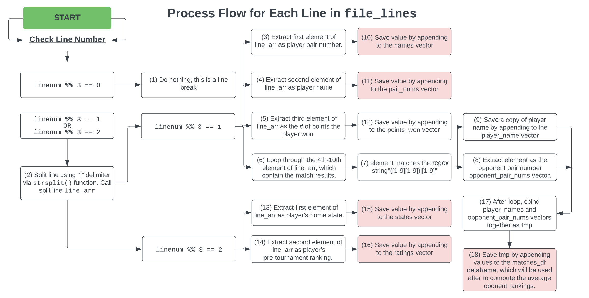

```{r setup, include=FALSE}
knitr::opts_chunk$set(echo = TRUE)
```


```{r, include=FALSE}

# Imports
library("RCurl")
library("dplyr")
library("ggplot2")
library("tidyverse") 
library("png")
```

## Introduction

The goal of this project is to turn a sample of messy chess tournament data into a readable, ingestible `.csv` format. The `.txt` file containing the raw data can be found at the following [link](https://raw.githubusercontent.com/williamzjasmine/CUNY_SPS_DS/master/DATA_607/Projects/Project1/tournamentinfo.txt). The desired output of the data is to create a `.csv` file with the following variables: player name, player state, total number of points won, player’s pre-tournament ELO rating, and average ELO rating of all the player's opponents. 

## Import Data from CSV

The first step is to import the data from the location above. The data is initially read in as a single string, and a sample of the raw data is printed out below using the `substr` function: 

```{r}
raw_data <- getURL('https://raw.githubusercontent.com/williamzjasmine/CUNY_SPS_DS/master/DATA_607/Projects/Project1/tournamentinfo.txt')

print(substr(raw_data, 1, 1000))
```

Printing out the first 1,000 characters of the texts reveals a bit of a mess, but it is clear that the file is broken up by lines given the presence of the `\n` characters. The code chunk below splits the `raw_data` line by line using the `strsplit()` function to create a character vector called `file_lines`:

```{r}
file_lines <-strsplit(raw_data, split="\n", fixed=TRUE)[[1]]
print(file_lines[1:10])
```

Looking at the first 10 lines outputted above, it is clear that the first four lines are header lines and contain no useful information. They are removed in the chunk below: 

```{r}
file_lines = file_lines[-1:-4]
file_lines[1:8]
```

Printing the first 8 lines of the new `file_lines` vector above confirms that these header lines have now been removed. 

## Parse File

Now that the text information is in an iterable format based on line, we can go through the `file_lines` vector line-by-by line to determine the information needed. Looking above it appears as though the lines have a particular pattern to them, and exist in groups of three. In this group of three lines: 

1. The first line contains the pair number, name, number of points won, the results of each of the player's matches, and the pair number of each opponent they played. For instance, in line [1] above the pair number is 1, the player's name is GARY HUA, he scored 6.0 points in the tournament, and he played seven games (winning against player 39, 21, 18, 14, 7, 12, and 4).
2. The second line contains the players state and pre tournament ranking. For instance in line [2], we see that GARY HUA is from ON (Ontario) and had a pre tournament ELO ranking of 1,794. 
3. The third line is a line break made up of `-` characters to separate out the information for the next player. 

Based off this pattern outlined above, we can pick out all the relevant information to create the desired `.csv` file. This is done below:

```{r}
matches_df <- data.frame(matrix(ncol = 2, nrow = 0))
names = c()
pair_nums = c()
states = c()
points = c()
ratings = c()

for (line_num in 1:length(file_lines)){
  if (line_num %% 3 == 0){
    next # (1)
  }
  else {
    line_arr <- strsplit(file_lines[line_num], "|", fixed = TRUE) # (2) 
    #print(line_arr)
    if (line_num %% 3 == 1) {
      pair_num <- as.integer(
        gsub(line_arr[[1]][1], pattern = " ", replacement = "")) # (3) 
      name <- str_extract(line_arr[[1]][2], '[A-Z].*[A-Z]') # (4) 
      points_won =  as.numeric(
        gsub(line_arr[[1]][3], pattern = " ", replacement = "")) # (5) 
      opponent_pair_nums = c()
      for (col_num in 4:10){ # (6)
        opponent_pair_num = str_extract(line_arr[[1]][col_num],
                                        '([1-9][0-9])|[0-9]') # (7)
        if (is.na(opponent_pair_num) == FALSE) { # (7)
          opponent_pair_nums = append(as.integer(opponent_pair_num),
                                      opponent_pair_nums) # (8)
        }
      }
      player_name = rep(name, length(opponent_pair_nums)) # (9) 
      tmp = cbind.data.frame(player_name, opponent_pair_nums) # (17)
      matches_df = rbind(matches_df, tmp) # (18)
      pair_nums = append(pair_nums, pair_num) # (10)
      names = append(names, name) # (11)
      points = append(points, points_won) # (12)
    }
    else if (line_num %% 3 == 2) {
      state <- gsub(line_arr[[1]][1], pattern = " ", replacement = "") # (13)
      pre_rating <- as.integer(
          gsub(gsub(str_extract(line_arr[[1]][2], ' \\d{3,4}(( )|P)'),
                    pattern=" ", replacement=''),
               pattern='P', replacement='')) # (14)
      states = append(states, state)
      ratings = append(ratings, pre_rating)
    }
    else {
      print('Something went wrong')
    }
  }
  
}

```

The code above contains a lot of different `if` statements and `for` loops, making it a little difficult to understand the logical flow on the surface. As such, the following graphic provides a flowchart of what it performs: .

The flowchart describes the logical flow of the code, but doesn't specify the exact regex matching or string manipulation that was used to extract the necessary values. In order to view this detail, the numbers in the flowchart cells correspond to the commented numbers in the above code specifying exactly where each action took place.

The red cells indicate the times in which desired values are saved to various vectors to be used in the following code. Five of these vectors (`names`,  `pair_nums`, `states`, `points`, and `ratings`) are combined below into what will be our final dataframe (`final_df`) using the `cbind` function. Appropriate column names are also given to this dataframe.  

```{r}
final_df = cbind.data.frame(names, pair_nums, states, points, ratings)
colnames(final_df) <- c('player_name', 'pair_number', 
                        'state', 'points_won', 'pre_rating')
colnames(matches_df) <- c('player_name', 'pair_number')
 
head(final_df)

```

The output above shows that our data is now very close to being in the desired format: the only column now missing is the average rating of each player's opponent. 

## Calc Average Ratings 

To calculate the average rating of each opponent, we can use the `matches_df` dataframe created in the cell chunk containing the primary parsing code. This dataframe contains a record of all the games that were played, namely a list of each player name and all of their associated opponent pair numbers. This can also be clarified in the graphic above by following the logical flow after cell (6). The chunk below calculates the average rating of each opponent using a `groupby()`:

```{r}
avg_opponent_score_df <- 
  matches_df %>%
    left_join(final_df, by = "pair_number", suffix=c("", "_y")) %>%
      group_by(player_name) %>%
        summarise(avg_opponent_score=mean(pre_rating))
```

The results are stored in a dataframe called `avg_opponent_score_df`. 

## Putting it All Together

The final step to having all the required data is to join our `final_df` to the newly created `avg_opponent_score_df` and pulling the average opponent score. This is done below: 

```{r}
final_df <- 
  final_df %>%
    left_join(avg_opponent_score_df, by='player_name')

final_df <- final_df[-2]
final_df
```
And that's it! The text file has now been transformed into an R dataframe containing the desired columns. This R dataframe is converted into a `.csv` in the cell below, and can be used for further analysis. 

```{r}
write.csv(final_df,"tournamentinfo.csv", row.names = FALSE)
```
