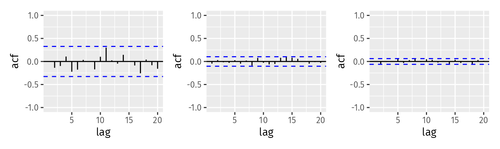

All exercises can be found in ["Forecasting: Principles and Practice"](https://otexts.com/fpp3/index.html) written by Rob J Hyndman and George Athanasopoulos.

# Setup

The following packages are required to rerun this `.rmd` file:

```{r setup, error=FALSE, warning=FALSE, message=FALSE}
seed_num <- 42
library(tidyverse)
library(fpp3)
```

# Exercise 9.1
## Description

[Figure 9.32](https://otexts.com/fpp3/arima-exercises.html#fig:wnacfplus) (shown below) the ACFs for 36 random numbers, 360 random numbers and 1,000 random numbers.




a. Explain the differences among these figures. Do they all indicate that the data are white noise?

b. Why are the critical values at different distances from the mean of zero? Why are the autocorrelations different in each figure when they each refer to white noise?

## Solution

# Exercise  9.2 
## Description

A classic example of a non-stationary series are stock prices. Plot the daily closing prices for Amazon stock (contained in `gafa_stock`), along with the ACF and PACF. Explain how each plot shows that the series is non-stationary and should be differenced.

## Solution

# Exercise 9.3
## Description

For the following series, find an appropriate Box-Cox transformation and order of differencing in order to obtain stationary data.

a. Turkish GDP from `global_economy`.
b. Accommodation takings in the state of Tasmania from `aus_accommodation`.
c. Monthly sales from `souvenirs`.

## Solution

# Exercise 9.5
## Description

For your retail data (from Exercise 7 in Section 2.10), find the appropriate order of differencing (after transformation if necessary) to obtain stationary data.

## Solution

# Exercise 9.6
## Description

Simulate and plot some data from simple ARIMA models.

a. Use the following R code to generate data from an AR(1) model with $\phi_1=0.6$ and $\sigma^2=1$. The process starts with $y_1=0$.

```
y <- numeric(100)
e <- rnorm(100)
for(i in 2:100)
  y[i] <- 0.6*y[i-1] + e[i]
sim <- tsibble(idx = seq_len(100), y = y, index = idx)
```

b. Produce a time plot for the series. How does the plot change as you change $\phi_1$?

c. Write your own code to generate data from an MA(1) model with $\theta_1=0.6$ and $\sigma^2=1$.

d. Produce a time plot for the series. How does the plot change as you change $\theta_1$?

e. Generate data from an ARMA(1,1) model with $\phi_1=0.6$, $\theta_1=0.6$ and $\sigma_2=1$. 

f. Generate data from an AR(2) model with $\phi_1=−0.8$, $\phi_2=0.3$, and $\sigma^2=1$. (Note that these parameters will give a non-stationary series.)

g. Graph the latter two series and compare them.


## Solution

# Exercise 9.7
## Description

Consider `aus_airpassengers`, the total number of passengers (in millions) from Australian air carriers for the period 1970-2011.

a. Use `ARIMA()` to find an appropriate ARIMA model. What model was selected. Check that the residuals look like white noise. Plot forecasts for the next 10 periods.

b. Write the model in terms of the backshift operator.

c. Plot forecasts from an ARIMA(0,1,0) model with drift and compare these to part a.

d. Plot forecasts from an ARIMA(2,1,2) model with drift and compare these to parts a and c. Remove the constant and see what happens.

e. Plot forecasts from an ARIMA(0,2,1) model with a constant. What happens?

## Solution

# Exercise 9.8
## Description

For the United States GDP series (from `global_economy`):

a. if necessary, find a suitable Box-Cox transformation for the data;

b. fit a suitable ARIMA model to the transformed data using ARIMA();

c. try some other plausible models by experimenting with the orders chosen;

d. choose what you think is the best model and check the residual diagnostics;

e. produce forecasts of your fitted model. Do the forecasts look reasonable?

f. compare the results with what you would obtain using ETS() (with no transformation).

## Solution 
